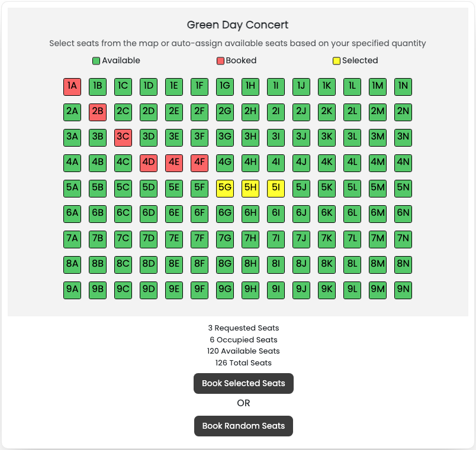

# Exam #3: "Concert Seats"
## Student: Mastrorocco Flavio
**Exam Assignment**: Design and implement a web application to reserve seats at a set of concerts held in theatres. The project must be implemented as a React application that interacts with an HTTP API server implemented in Node+Express. The database must be stored in an SQLite file. User authentication and API access must be with Passport.js and session cookies.

## React Client Application Routes

### Public Routes
- Route `/`: The homepage for unauthenticated users (also showed to authenticated ones). Displays a list of all available concerts.
- Route `/login`: A login form, allows users to login. After a successful login, the user is redirected to the main route `"/"`.
- Route `/seatview?id=CONCERT_ID`: Displays seat availability for a given concert based on the `CONCERT_ID`, that is passed as a query parameter (`id`) in the URL from the homepage `/` concert list.

### Authenticated Routes
- Route `/ticketing`: Allows logged-in users to reserve tickets for concerts. Displays a list of concerts along with reservation status for each concert (e.g., "Booked").
- Route `/seatmap/:concertID`: Shows a detailed seat map for the specified concert. The `concertID` is passed as a route parameter, enabling users to view and select available seats for the concert.
- Route `/reservations`: Displays a list of all reservations made by the logged-in user. Users can review their bookings and delete their concert tickets from this page.

### Catch-All Route
- Route `*`: A 404 Not Found landing page. This route is displayed when users attempt to access an undefined route.

## API Server

### Authentication APIs

* **POST `/api/session`**: Authenticate and login the user.
  - **Request body**: JSON object with _username_ equal to email:
    ```
    { "username": "user1@polito.it", "password": "password1" }
    ```
  - **Response body**: JSON object with the user's info and its status (or a description of the errors):  
    ```
    { "user_id": 1, "username": "user1", "email": "u1@polito.it", "status": "loyal" }
    ```
  - Codes: `200 OK`, `401 Unauthorized` (incorrect email and/or password), `400 Bad Request` (invalid request body), `500 Internal Server Error`.

* **GET `/api/session`**: Get info on the logged in user.
  - **Response body**: JSON object with the same info as in login:   
    ```
    { "user_id": 1, "username": "user1", "email": "u1@polito.it", "status": "loyal" }
    ```
  - Codes: `200 OK`, `401 Unauthorized`, `500 Internal Server Error`.

* **DELETE `/api/session`**: Logout the user.
- **Response body**: JSON object with response:   
    ```
    { "message": "User logged out" }
    ```
  - Codes: `200 OK`, `401 Unauthorized`, `500 Internal Server Error`.


### Token API's

* **GET `/api/auth-token`**: Retrieve the authentication token.
  - **Token**:
    ```
    const payloadToSign = { userID: userID, userStatus: userStatus };
    const jwtToken = jsonwebtoken.sign(payloadToSign, jwtSecret, {expiresIn: 60});
    ```
  - **Response body**: 
    ```
    { "token": "JWT_token" }
    ```
  - Codes: `200 OK`, `401 Unauthorized`, `500 Internal Server Error`.

### Reservation API's (PROTECTED require user authentication)

* **POST `/api/reservation` (PROTECTED)**: This route makes a reservation in the database.
  - **Request body**: JSON object with the _concert_id_ and _seats_ array that you want to reserve:
    ```
    { concert_id: "CONCERT_ID", seat: [SEATS_ARRAY] }
    ```
  - **Response body**: JSON object with message response (or error message):
    ```
    { message: "Reservation made successfully.", seats: [SEATS_ARRAY] }
    ```
  - Codes: `200 OK`, `400 Bad Request`, `401 Unauthorized`, `404 Not Found`, `409 Conflict`, `500 Internal Server Error`.

* **POST `/api/reservation/random` (PROTECTED)**: This function makes a reservation based on the number of seats you want to reserve. The logic used is filling row by row the theater's seats.
  - **Request body**: JSON object with the _concert_id_ and _num_seats_ that you want to reserve:
    ```
    { concert_id: "CONCERT_ID", num_seats: "NUM_SEATS" }
    ```
  - **Response body**: JSON object with message response (or error message):
    ```
    { message: "Reservation made successfully.", seats: [SEATS_ARRAY] }
    ```
  - Codes: `200 OK`, `400 Bad Request`, `401 Unauthorized`, `404 Not Found`, `500 Internal Server Error`.

* **DELETE `/api/reservation/:reservation_id` (PROTECTED)**: This function deletes a reservation (_reservation_id_) from the database.
  - **Response body**: JSON object with response message (or error message):
    ```
    { message: "Reservation deleted successfully." }
    ```
  - Codes: `200 OK`, `400 Bad Request`, `401 Unauthorized`, `500 Internal Server Error`.

* **GET `/api/reservation/concerts`**: This function retrieves all concerts from the database.
  - **Response body**: JSON object (or error message):
    ```
    [
      {
        "concert_id": 1,
        "theater_id": 1,
        "artist": "Oasis",
        "date": "2025-07-26",
        "theater_name": "Wembley Stadium",
        "city": "London",
        "rows": 9,
        "columns": 14
      }, ...
    ]
    ```
  - Codes: `200 OK`, `500 Internal Server Error`.

* **GET `/api/reservation/concert/:concert_id`**: This function retrieves all reserved seats of a _concert_id_ from the database (or at least the artist if there is no reservation).
  - **Response body**: JSON object (or error message):
    ```
    {
      "concert_id": 1,
      "artist": "Oasis",
      "seats": [ "1A", "2A", "3A", "1B", "2B", "3B", "1C", "2C", "3C", "1D", "2D", "3D" ]
    }
    ```
  - Codes: `200 OK`, `400 Bad Request`, `404 Not Found`, `500 Internal Server Error`.

* **GET `/api/reservation/concert/:concert_id/user/:user_id` (PROTECTED)**: This function retrieves all reservations of a _concert_id_ and _user_id_ from the database.
  - **Response body**: JSON object (or error message):
    ```
    {
      "user_id": 1,
      "concert_id": "1",
      "artist": "Oasis",
      "seats": [ "1A", "2A", "3A" ]
    }
    ```
  - Codes: `200 OK`, `400 Bad Request`, `401 Unauthorized`, `404 Not Found`, `500 Internal Server Error`.

* **GET `/api/reservation/concert/:concert_id/count`**: This function retrieves reserved, available, total seats and dimension of a theatre of a concert_id from the database.
  - **Response body**: JSON object (or error message):
    ```
      {
        "concert_id": 1,
        "reserved": 12,
        "available": 114,
        "total": 126,
        "rows": 9,
        "columns": 14
      }
    ```
  - Codes: `200 OK`, `400 Bad Request`, `404 Not Found`, `500 Internal Server Error`.

* **GET `/api/reservation/user/:user_id` (PROTECTED)**: This function retrieves all reservations of an user_id from the database.
  - **Response body**: JSON object (or error message):
    ```
    [
      {
          "reservation_id": 1,
          "reservation_date": "2023-07-25",
          "concert_id": 1,
          "concert_artist": "Oasis",
          "concert_date": "2025-07-26",
          "theater_name": "Wembley Stadium",
          "city": "London",
          "reserved_seats": [ "1A", "2A", "3A" ]
      }, ...
    ]
    ```
  - Codes: `200 OK`, `400 Bad Request`, `401 Unauthorized`, `403 Forbidden`, `404 Not Found`, `500 Internal Server Error`.

## API Server2

* **POST `/api/discount` (PROTECTED)**: This function retrieves the discount percentage for a specified concert based on the reserved seats and the user's loyalty status. Access to this endpoint is restricted to authenticated users with JWT token (`'Authorization': 'Bearer ${authToken}'` in the header).
  - **Token Payload**: _user_id_ and _userStatus_ stored in JWT Token Payload
    ```
    { userID: userID, userStatus: userStatus };
    ```
  - **Request body**: JSON object with the _seats_ array.
    ```
    { seats: [SEATS_ARRAY] }
    ```
  - **Response body**: JSON object with message response (or error message):
    ```
    { discount: "DISCOUNT_VALUE" }
    ```
  - Codes: `200 OK`, `400 Bad Request`, `401 Unauthorized`, `500 Internal Server Error`.

## Database Tables

### `users` Table
```
CREATE TABLE IF NOT EXISTS users (
  user_id INTEGER PRIMARY KEY AUTOINCREMENT,
  username TEXT NOT NULL,
  email TEXT NOT NULL UNIQUE,
  password TEXT NOT NULL,
  salt TEXT NOT NULL,
  status TEXT NOT NULL DEFAULT 'normal' CHECK (status IN ('normal', 'loyal'))
)
```

### `theaters` Table
```
CREATE TABLE IF NOT EXISTS theaters (
  theater_id INTEGER PRIMARY KEY AUTOINCREMENT,
  theater_name TEXT NOT NULL,
  city TEXT,
  rows INTEGER NOT NULL,
  columns INTEGER NOT NULL
)
```

### `concerts` Table
```
CREATE TABLE IF NOT EXISTS concerts (
  concert_id INTEGER PRIMARY KEY AUTOINCREMENT,
  theater_id INTEGER NOT NULL,
  artist TEXT NOT NULL,
  date DATE,
  FOREIGN KEY (theater_id) REFERENCES theaters(theater_id)
)
```

### `reservation` Table
```
CREATE TABLE IF NOT EXISTS reservations (
  reservation_id INTEGER PRIMARY KEY AUTOINCREMENT,
  concert_id INTEGER NOT NULL,
  user_id INTEGER NOT NULL,
  reservation_date DATE,
  FOREIGN KEY (concert_id) REFERENCES concerts(concert_id),
  FOREIGN KEY (user_id) REFERENCES users(user_id)
)
```

### `tickets` Table
```
CREATE TABLE IF NOT EXISTS tickets (
  ticket_id INTEGER PRIMARY KEY AUTOINCREMENT,
  reservation_id INTEGER NOT NULL,
  seat TEXT NOT NULL,
  FOREIGN KEY (reservation_id) REFERENCES reservations(reservation_id)
)
```

## Main React Components
- `AuthChecker` (in `App.jsx`): This component checks if the user is authenticated on every `location.pathname` change and redirects to the login page if the user is not authenticated.
- `Header` (in `App.jsx`): This component renders the navigation bar at the top of the application, including links to the homepage, login page, and other sections.
- `Home` (in `App.jsx`): This component displays the list of all available concerts on the homepage, accessible to both authenticated and unauthenticated users.
- `Login` (in `App.jsx`): This component provides a form for users to log in to their accounts. Upon successful login, users are redirected to the homepage.
- `SeatView` (in `App.jsx`): This component shows the availability of seats for a specific concert. It is accessed via the `/seatview` route with a `CONCERT_ID` query parameter.
- `Ticketing` (in `App.jsx`): This component allows logged-in users to reserve tickets for concerts, displaying a list of concerts with their reservation status (e.g., "Booked").
- `SeatMap` (in `App.jsx`): This component displays a detailed seat map for a specific concert, allowing users to view and select available seats in order to reserve them. It is accessed via the `/seatmap/:concertID` route.
- `Reservations` (in `App.jsx`): This component shows a list of all reservations made by the logged-in user, allowing them to review and delete their bookings.

(only _main_ components, minor ones may be skipped)

## Screenshot



## Users Credentials
Here you can find a list of the users already registered inside the provided database.

| id | username |    email      | plain-text password | status |
|----|----------|---------------|---------------------|--------|
| 1  |  user1   | u1@polito.it  |      password1      | loyal  |
| 2  |  user2   | u2@polito.it  |      password2      | normal |
| 3  |  user3   | u3@polito.it  |      password3      | normal |
| 4  |  user4   | u4@polito.it  |      password4      | loyal  |
| 5  |  user5   | u5@polito.it  |      password5      | normal |
| 6  |  user6   | u6@polito.it  |      password6      | loyal  |
